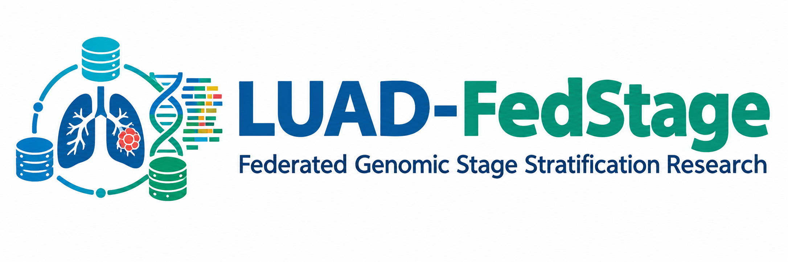
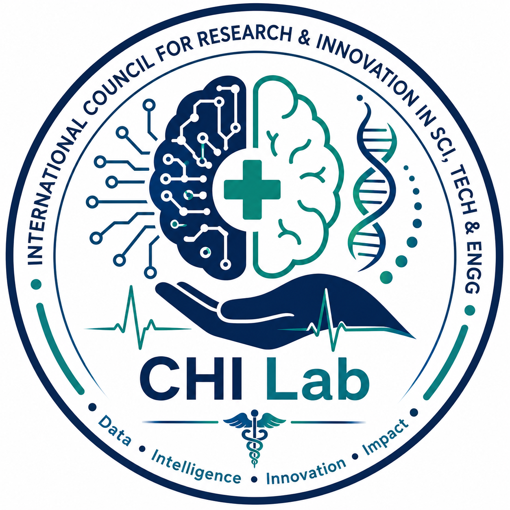

<p align="center">
  
</p>

# Privacy-Preserving Federated Learning for Genomic Stage Stratification in Lung Adenocarcinoma

## Project Overview

This repository contains the **code, genomic datasets, processed data, experimental configurations, and research outputs** for a Lung Adenocarcinoma (LUAD) stage-stratification project based on **mutation-centred genomic DNA sequences**.

The project investigates deep learning approaches for learning sequence-level representations around genomic mutations and evaluating their utility for **LUAD disease-stage stratification**.

The research pipeline integrates publicly accessible cancer genomics resources with mutation-centred sequence construction and deep learning experiments.

## Research Objectives

The project is designed around the following objectives:

- Retrieve and organise LUAD genomic and clinical information from publicly accessible cancer genomics resources.
- Identify relevant LUAD cohorts and maintain reproducible cohort-level study identifiers.
- Integrate cancer driver-gene information from **IntOGen**.
- Retrieve reference coding DNA sequences through **Ensembl BioMart**.
- Construct mutation-centred genomic DNA sequence windows.
- Evaluate different sequence-window configurations using deep learning.
- Investigate both binary and four-class LUAD stage-stratification tasks.
- Maintain a reproducible computational research pipeline with clearly separated raw, processed, experimental, and output data.

---

# Data & Research Resources

The project uses three principal external resources: **cBioPortal for Cancer Genomics**, **IntOGen**, and **Ensembl BioMart**. The source verification document identifies cBioPortal as the source of genomic mutation and clinical data, IntOGen as the driver-gene resource, and Ensembl BioMart as the source for reference coding DNA/gene sequences.

## Primary Resources

| Resource | Link |
|:---|:---|
| **cBioPortal for Cancer Genomics** | [](https://www.cbioportal.org/) |
| **IntOGen Cancer Driver Genes** | [](https://www.intogen.org/download) |
| **Ensembl BioMart** | [](https://mart.ensembl.org/info/data/biomart/index.html) |

---

# LUAD Cohorts

Seven LUAD-related cohorts from **cBioPortal** are incorporated into the research workflow. For reproducibility, the **cBioPortal Study ID** should be retained alongside the project-level cohort name. The source document explicitly identifies the study IDs as the most reliable cohort identifiers.

| # | Cohort | cBioPortal Study ID | Direct Resource |
|:---:|:---|:---|:---:|
| **1** | **TCGA Atlas 2018** | `luad_tcga_pan_can_atlas_2018` | [](https://www.cbioportal.org/study/summary?id=luad_tcga_pan_can_atlas_2018) |
| **2** | **LUNG MSK 2017** | `lung_msk_2017` | [](https://www.cbioportal.org/study/summary?id=lung_msk_2017) |
| **3** | **MSK NPJ Precision Oncology 2021** | `luad_msk_npjpo_2021` | [](https://www.cbioportal.org/study/summary?id=luad_msk_npjpo_2021) |
| **4** | **MSKCC 2020** | `luad_mskcc_2020` | [](https://www.cbioportal.org/study/summary?id=luad_mskcc_2020) |
| **5** | **MSKCC 2023** | `luad_mskcc_2023_met_organotropism` | [](https://www.cbioportal.org/study/summary?id=luad_mskcc_2023_met_organotropism) |
| **6** | **NCI 2022** | `lung_nci_2022` | [](https://www.cbioportal.org/study/summary?id=lung_nci_2022) |
| **7** | **ONCOSG 2020** | `luad_oncosg_2020` | [](https://www.cbioportal.org/study/summary?id=luad_oncosg_2020) |

The cohort names and study IDs above follow the verification sheet. In particular, the project uses `lung_nci_2022` for the cohort labelled **NCI 2022**, while the underlying study title refers to *Lung Cancer in Never Smokers (NCI, Nature Genetics 2021)*.

---

# Sequence-Based Experiments

## Experiment 1 — 101-bp Mutation-Centred Windows

The baseline experiment uses a **101-bp mutation-centred genomic sequence window**:

```text
50 bp upstream + 1 mutation position + 50 bp downstream
```

**Mutation index:** `50`

### Experimental Directory

```text
Experiment_1_101bp/
```

This experiment establishes the baseline sequence representation for downstream deep learning analysis.

---

## Experiment 2 — 301-bp Mutation-Centred Windows

The main experiment uses a **301-bp mutation-centred genomic sequence window**:

```text
150 bp upstream + 1 mutation position + 150 bp downstream
```

**Mutation index:** `150`

### Experimental Directory

```text
Experiment_2_301bp/
```

Code and experimental results for the 301-bp configuration are organised within this directory.

---

# Research Pipeline

```text
┌───────────────────────────┐
│   cBioPortal LUAD Data    │
└─────────────┬─────────────┘
              │
              ▼
┌───────────────────────────┐
│ Mutation & Clinical Data  │
└─────────────┬─────────────┘
              │
              ▼
┌───────────────────────────┐
│ IntOGen Driver-Gene Data  │
└─────────────┬─────────────┘
              │
              ▼
┌───────────────────────────┐
│ Ensembl Reference CDS     │
└─────────────┬─────────────┘
              │
              ▼
┌───────────────────────────┐
│ Mutation-Centred Windows  │
│       101-bp / 301-bp     │
└─────────────┬─────────────┘
              │
              ▼
┌───────────────────────────┐
│ Sequence Representation   │
└─────────────┬─────────────┘
              │
              ▼
┌───────────────────────────┐
│ Deep Learning Modelling   │
└─────────────┬─────────────┘
              │
              ▼
┌───────────────────────────┐
│ LUAD Stage Stratification │
└───────────────────────────┘
```

---

# Research Tasks

The project evaluates two LUAD stage-stratification formulations:

### Binary Stage Stratification

```text
Early Stage
Stage I–II
      │
      │
      ▼
Advanced Stage
Stage III–IV
```

### Four-Class Stage Stratification

```text
Stage I
Stage II
Stage III
Stage IV
```

These two task definitions are part of the project's experimental research scope.

---

# Repository Structure

```text
.
├── data/
│   ├── raw/
│   │   ├── cbioportal/
│   │   ├── intogen/
│   │   └── ensembl/
│   │
│   └── processed/
│       ├── 101bp/
│       └── 301bp/
│
├── Experiment_1_101bp/
│
├── Experiment_2_301bp/
│
└── README.md
```

The repository separates raw external resources, processed sequence datasets, and experiment-specific code/results to support reproducible computational research. The original repository structure follows these same data and experiment directories.

---

# Git Large File Storage

Large genomic datasets and processed research files are maintained using **Git Large File Storage (Git LFS)**.

After cloning the repository:

```bash
git lfs install
git lfs pull
```

This follows the Git LFS workflow specified in the previous repository documentation.

---
# Research Portal

The **LUAD-FedStage Research Portal** is available for demonstration and exploration:

<p align="center">
  
</p>

[](Federated_Learning/LUAD-Federated-Research-Portal-Demo/)

| **YouTube Channel** |[](https://youtu.be/sJv5555ozVw)|


It implements:

- Early (Stages I-II) versus Advanced (Stages III-IV) binary LUAD stage-group classification.
- Mutation-centred 301-bp genomic windows with the validated Federated Binary BiLSTM.
- Three simulated research clients/hospitals and sample-weighted Federated Averaging (FedAvg).
- Data-local inference, a local research report archive, and a central federated server dashboard.
- CHI Lab branding with the ICRI-STE research affiliation.

This is a privacy-aware, data-local federated research prototype. It does not claim differential privacy, secure aggregation, or a formal privacy guarantee.

> **Research prototype - not for clinical diagnosis or treatment decisions.**

> **Research focus:** Mutation-centred genomic DNA sequences → Deep Learning → LUAD Stage Stratification

---


# Quick Access — Research Resources

| Resource | Link |
|:---|:---|
| **cBioPortal — Cancer Genomics Platform** | [](https://www.cbioportal.org/) |
| **IntOGen — Cancer Driver Genes** | [](https://www.intogen.org/download) |
| **Ensembl — BioMart** | [](https://mart.ensembl.org/info/data/biomart/index.html) |
| **TCGA Atlas 2018** | [](https://www.cbioportal.org/study/summary?id=luad_tcga_pan_can_atlas_2018) |
| **LUNG MSK 2017** | [](https://www.cbioportal.org/study/summary?id=lung_msk_2017) |
| **MSK NPJ Precision Oncology 2021** | [](https://www.cbioportal.org/study/summary?id=luad_msk_npjpo_2021) |
| **MSKCC 2020** | [](https://www.cbioportal.org/study/summary?id=luad_mskcc_2020) |
| **MSKCC 2023 Metastatic Organotropism** | [](https://www.cbioportal.org/study/summary?id=luad_mskcc_2023_met_organotropism) |
| **NCI 2022** | [](https://www.cbioportal.org/study/summary?id=lung_nci_2022) |
| **ONCOSG 2020** | [](https://www.cbioportal.org/study/summary?id=luad_oncosg_2020) |
| **LUAD-FedStage Research Portal** | [](Federated_Learning/LUAD-Federated-Research-Portal-Demo/)|

---

# Research Scope

This repository represents an **experimental computational research pipeline** for LUAD genomic sequence modelling and stage stratification.

The current scope includes:

- Cancer genomics data integration
- Mutation-centred DNA sequence construction
- Driver-gene resource integration
- Reference CDS retrieval
- Deep learning-based sequence analysis
- Binary LUAD stage stratification
- Four-class LUAD stage stratification
- Multi-cohort computational experimentation
- Reproducible research data organisation

> **Important:** This repository represents an experimental research pipeline and is **not a clinically validated diagnostic system**.

---

# Reproducibility

For reproducible research, users should retain:

1. The **cBioPortal study ID** for every cohort.
2. The corresponding raw genomic/clinical data.
3. The IntOGen driver-gene resources used.
4. The Ensembl reference sequence source.
5. The sequence-window configuration.
6. The experiment-specific code.
7. The processed datasets.
8. The model configuration and experimental outputs.

The cBioPortal study ID is particularly important because the verification document identifies it as the most reliable identifier for reporting each cohort.


---
# Computational Healthcare Intelligence Lab (CHI Lab) 
## Research Leadership

**Dr. Didar Murad**

Principal Investigator & Founding Director

**CHI Lab, ICRI-STE** 

This project forms part of the CHI Lab's computational healthcare and cancer research activities, integrating **systems-oriented computational research, cancer genomics, and artificial intelligence/deep learning**

[](https://icriste.com/computational-healthcare-intelligence-lab-chi-lab/)
[](https://icriste.com)

---

</p>
<div align="center">


&nbsp;&nbsp;&nbsp;&nbsp;&nbsp;


**Computational Healthcare Intelligence | Dry Lab**

*From Cancer Genomics to Computational Intelligence*
